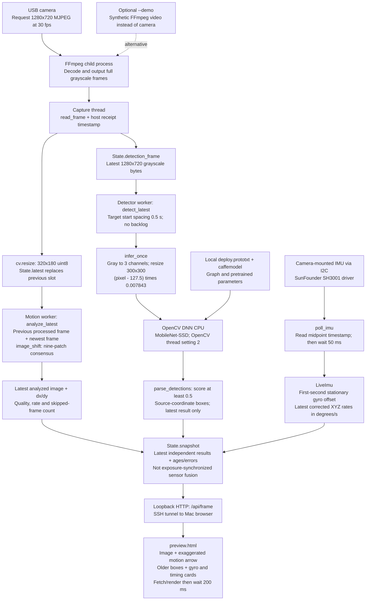

# Current live pipeline

Reviewed 2026-10-08 for the learning refactor based on Desktop source at
`6a53d27` plus the user's documentation changes. Diagram reviewed; data flow,
image sizes, timing targets and freshness policies are unchanged. Named callbacks,
function contracts and statement explanations add readability, not a new pipeline.
Read [the study index](learning/README.md)
for the end-to-end code tour. Maintain this file as code changes, as required
by [AGENTS.md](../AGENTS.md) and [the plan standard](../.agent/PLANS.md).

The diagram assumes `app.live_preview` with both `--imu` and `--detect` enabled.
Only FFmpeg is a separate child process. The capture, motion, detection and
IMU workers are Python threads in one application. OpenCV's internal threads
are distinct from those application workers. The browser runs on the Mac.

## Text fallback and mode differences

Camera -> FFmpeg -> capture reader -> two image branches: small images go to
motion analysis; full images go to slower object detection. The independent
I2C IMU reader supplies corrected angular rates. A snapshot combines the latest
available outputs for display, not for a shared-time estimate of camera pose.

With detection off, FFmpeg downsizes to 320x180 before the pipe; there is no full
image slot or detector worker. With IMU off, no IMU reader is started. `--demo`
substitutes synthetic imagery only; it does not simulate gyro or detections.
Enabling `--imu` with demo still attempts a real sensor read.

## Rates are separate controls

| Stage | Policy in code | What it does not guarantee |
|---|---|---|
| Capture | Request 30 fps, 720p MJPEG | Exposure-to-display timing or achieved downstream fps |
| Motion | Process newest frame when ready | Fixed 30 Hz or processing every captured frame |
| Detector | Start no faster than every 0.5 s | Exactly 2 results/s if compute takes longer |
| IMU | Read, then wait 0.05 s | Exactly 20 Hz or the chip's internal sampling frequency |
| Browser | Fetch/render, then wait 200 ms | Showing every processed image; refresh is below 5 Hz with overhead |

The detector's 2 Hz setting limits expensive CPU work while motion/IMU/capture
continue. It is a baseline choice, not a measured optimum. The 0.5-second
condition-wait timeout in the motion worker is not a 2 Hz throttle: a new frame
notification can wake it earlier. OpenCV's two threads are not two reserved
cores and are unrelated to the two-Hz scheduler.

## Data and timing boundaries

- Capture timestamps are monotonic host receipt times after complete pipe reads,
  before the small-image resize. They are not sensor exposure timestamps.
- IMU timestamps are midpoints of the host interval around `read_raw()`.
- Detector source age starts at that frame's capture receipt, not inference
  completion. Old boxes can overlay a newer motion image; no tracking corrects
  them. Boxes are hidden if older than 1.5 s or the camera state is not live.
- IMU values become stale above 300 ms; startup without samples has a separate
  two-second check. Camera results become stale above two seconds and have a
  ten-second no-analyzed-frame startup check.
- Ages are measured on the Pi and exclude SSH/browser delay. The HTTP snapshot
  reads separately protected state objects; it is not one simultaneous sample.
- Bounded latest slots prevent an application history queue; this does not mean
  drivers, pipes or networking have no buffers. A worker can still hold its
  current frame while the capture slot is replaced.

## Other input/output paths

Model files and command-line options configure execution. Host clocks supply
timing measurements. FFmpeg stderr is drained by a diagnostic thread; it is
not mixed with raw pixels. Ctrl+C and the shared stop event end workers. The
HTTP server serves only the page and snapshot, not arbitrary files.

The live preview saves no footage, commands no servo and reads no usable
magnetometer/barometer stream. Acceleration and temperature returned with the
gyro are discarded by the live reader. Recording, gyro integration and saved
image benchmarking are separate commands linked from the study guides.

## Goal versus implementation

Current: observe scene displacement, recognize object categories and measure
angular rate concurrently. Future: align timing and coordinate frames, track
object identities and use camera motion to help distinguish moving objects
from a moving observer. Object memory, camera pose, IMU-driven box correction
and full spatial mapping are not implemented by this diagram.

## Diagram-update checklist for every implementation task

- [ ] Check entry points, optional modes and process/thread boundaries.
- [ ] Check shapes, units, model inputs, queues and ownership.
- [ ] Check rates, clocks, freshness thresholds and error paths.
- [ ] Check browser outputs and distinguish current from future features.
- [ ] Update the three guides and source references with the code change, or
  explicitly record "diagram reviewed; unchanged" and why.
