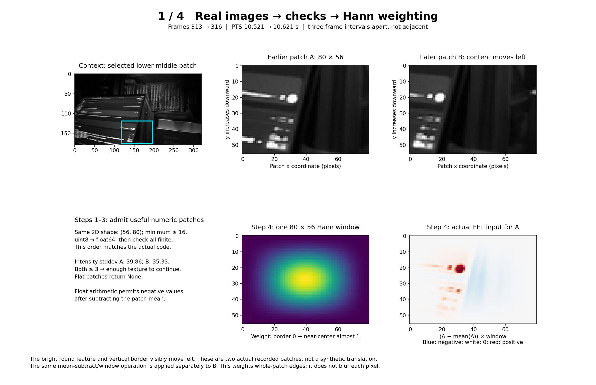
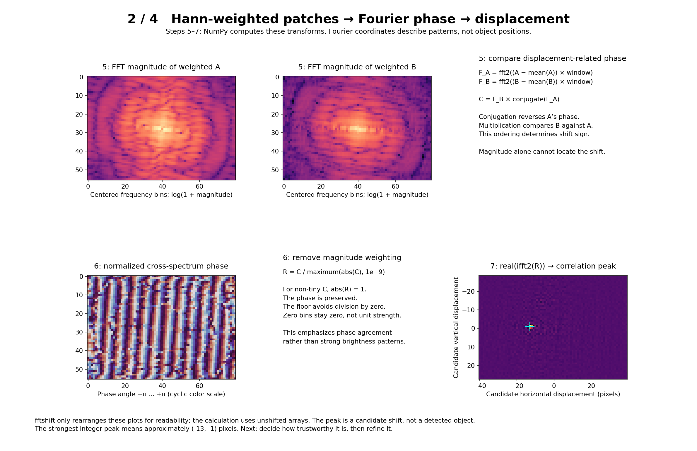
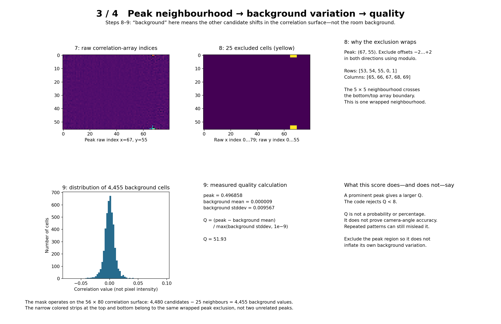
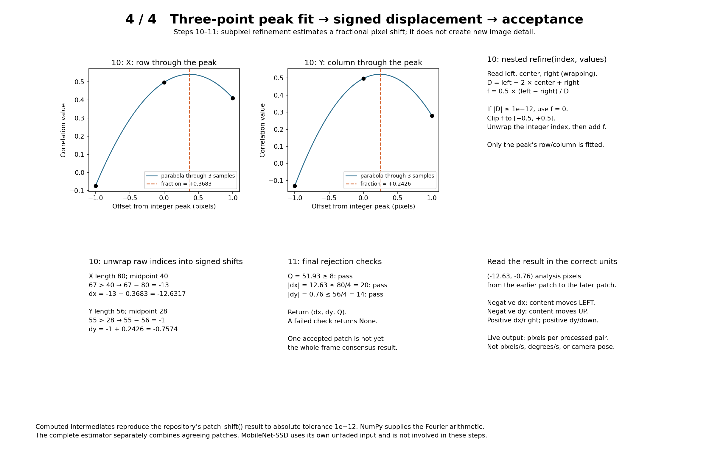

# From a real image pair to a subpixel motion estimate

Follow `patch_shift(first, second)` in
[visual_motion.py](../../src/recording/visual_motion.py). These four boards trace
the existing implementation; no estimator behavior was changed.

## The selected example

The source is the user's local `combined-motion-02/camera.mkv`. Zero-based
decoded frames 313 and 316 have presentation timestamps 10.521 and 10.621 seconds.
They are **three frame intervals apart**, deliberately selected to make motion
visible, not adjacent frames and not a synthetic translation. FFmpeg prepares
320×180 grayscale frames. We select the same 80×56 rectangle in both images:
`frame[119:175, 117:197]`. Array shape is `(height, width) = (56, 80)`.

Look at the bright circular feature and nearby vertical border: they move left.
The calculated patch shift is `dx=-12.6317, dy=-0.7574` analysis pixels.
This is an estimator output, not independently measured ground truth.
The source footage stays outside Git; only illustrated teaching figures and
[numeric intermediates](images/hann-fft-example.json) are stored here.

## Steps 1–4: useful pixels and soft boundaries

### 1. Validate shapes and numbers

`first.shape != second.shape`, `first.ndim != 2`, and
`min(first.shape) < 16` reject incompatible or too-small arrays with `ValueError`.
The finite-number check also raises `ValueError` for NaN or infinity.
One ordering clarification: **the code performs the float conversion in step 2
before the finite-number check**, although both belong to input validation.

### 2. Convert pixels to floating point

`a, b = first.astype(float), second.astype(float)` converts the unsigned 8-bit
pixels to floating point (float64 here). Original pixel values span 0–255;
subtraction and multiplication will need negative and fractional results.
This is arithmetic preparation, not MobileNet's input normalization.

### 3. Reject nearly featureless patches

`min(a.std(), b.std()) < 3` returns `None`. This is the standard deviation of
pixel intensities within each patch, not a measure of motion over time.
An almost uniform wall offers little pattern to match. Here the standard
deviations are 39.8574 and 35.3328, so both pass. Passing is a prerequisite,
not proof of a correct match.

### 4. Remove the mean, then apply the Hann window

`np.outer(np.hanning(56), np.hanning(80))` creates one separable 2D window for
the whole patch. It has zero outer-edge weights and near-one central weights.
For A the calculation is `(a - a.mean()) * window`; B is handled separately.
The means are 40.3433 and 33.5109. Red/blue in the figure show positive/negative
deviations, not literal red/blue scene colors. White represents zero.

The discrete Fourier representation treats opposite edges as joined in a
periodic repetition. A bright right edge meeting a dark left edge would create
an artificial jump. Tapering both toward zero reduces that jump; the same
applies to top and bottom. This is not a sliding CNN kernel, pixel-border blur,
or selection of a single central dot. Windowing can also change the estimate:
it is not a guarantee of perfect translation recovery.

## Steps 5–7: from spatial patterns to candidate displacements

### 5. Compute FFTs and compare phase

`np.fft.fft2` converts each weighted patch into complex coefficients describing
spatial frequency patterns. Magnitude describes strength; phase describes
alignment. A translation changes phases systematically. The calculation is
`cross = F_B * np.conj(F_A)`: conjugation reverses A's phase, so multiplication
compares B's phase with A's. Reversing the order would reverse the shift sign.

The FFT magnitude figures show `log(1 + abs(F))` with a shared color range.
They are not object maps. `fftshift` centers only the displayed arrays; it is
not part of `patch_shift()`'s calculation. **NumPy supplies the Fourier math**,
not MobileNet or OpenCV's detector.

### 6. Normalize the cross spectrum

`cross /= np.maximum(np.abs(cross), 1e-9)` preserves phase while removing
magnitude weighting from non-tiny coefficients. Their magnitude becomes one.
The small floor prevents division by zero; an exactly zero coefficient remains
zero. No bins in this particular example fall below the floor.

This frequency-domain normalization is unrelated to scaling detector pixels
into a model's expected numeric range.

### 7. Inverse-transform and find the strongest peak

`surface = np.fft.ifft2(cross).real` produces a correlation surface indexed by
candidate shifts. `np.argmax` finds its strongest cell; `np.unravel_index`
returns `(y, x)`. Here the raw index is `(55, 67)`, with value 0.496858.
The peak describes displacement, not where an object is located in the patch.

## Steps 8–9: is the peak distinctive?

### 8. Exclude a wrapped 5×5 neighbourhood

The boolean `mask` starts true. Offsets −2 through +2 around the peak are set
false using modulo indexing. The excluded rows are `53, 54, 55, 0, 1` and
columns `65, 66, 67, 68, 69`. Thus part of the neighbourhood appears at the
top of the array and part at the bottom. Correlation indices wrap.

This excludes **25 candidate-shift cells**, not 25 scene pixels. `side =
surface[mask]` retains 4,455 of the 4,480 cells to characterize the background
variation away from the peak.

### 9. Compute peak quality

The code computes `(peak - side.mean()) / max(side.std(), 1e-9)`.
Here background mean is 0.000009174 and background standard deviation is
0.009567192, yielding **Q = 51.9326**. Removing the peak neighbourhood keeps
the peak from inflating its own background reference. A bigger value means a
more prominent peak relative to these sidelobes. It is **not a probability**,
percentage, or guarantee that the physical camera motion was measured correctly.

## Steps 10–11: refine, unwrap and accept

### 10. Fit three samples and unwrap the index

The nested `refine(index, values)` receives the row through the peak for X,
then the column through it for Y. It reads the left/center/right neighbours
with wraparound. A three-point parabola gives
`fraction = 0.5 * (left - right) / (left - 2*center + right)`.
If the denominator's absolute value is at most `1e-12`, it uses zero;
otherwise the fraction is clipped to `[-0.5, +0.5]`.

Raw indices above half the axis length are interpreted as negative shifts:

| Axis | Raw index | Signed integer | Fraction | Refined shift |
|---|---:|---:|---:|---:|
| X, length 80 | 67 | 67 − 80 = −13 | +0.368280 | −12.631720 |
| Y, length 56 | 55 | 55 − 56 = −1 | +0.242621 | −0.757379 |

For Y, the right-hand neighbour of index 55 is index 0. These fractional
estimates interpolate the correlation peak; they do not create new camera detail.

### 11. Reject implausible or weak results; otherwise return

The code returns `None` if Q < 8, `abs(dx) > width/4`, or
`abs(dy) > height/4`. Here Q = 51.93, |dx| = 12.63 ≤ 20, and |dy| = 0.76 ≤ 14,
so it returns `(dx, dy, quality)`.

Positive dx means content moved right from A to B; positive dy means content
moved down. This example moves left and slightly up. The live result is
**analysis pixels per processed pair**, not pixels/second, degrees/second,
or camera pose. A timestamp interval is necessary to calculate velocity;
camera geometry and further assumptions are needed for angular interpretation.

## Where this fits in EdgeXR

`image_shift()` calls `patch_shift()` on nine fixed 80×56 patches in the
320×180 image. These are sampled regions, not an exhaustive partition of every
pixel. It requires at least four accepted patches, rejects estimates farther
than 1.5 pixels from the median displacement, requires four remaining matches,
then returns their median shift. This illustration follows **one patch**;
the final whole-image estimate can differ.

OpenCV is also a general image-processing library. With detection enabled,
the live preview uses it to resize the motion branch and separately to prepare
and run MobileNet-SSD. The detector's own input is not Hann-weighted.
These offline figures use FFmpeg resizing; live OpenCV resizing can produce
slightly different pixel values. No camera/IMU synchronization or hardware
accuracy claim is established by this example.

## Validation

All intermediate values were calculated from the recorded pair and the final
tuple matches the repository's `patch_shift()` within absolute tolerance
`1e-12`. All four rendered figures were visually checked. The live pipeline
diagram was reviewed; unchanged because this revision explains existing
calculations without changing application code or data flow.
